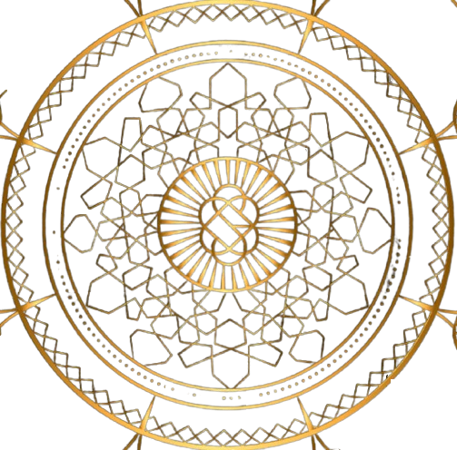

# Crypto Website Project

Welcome to the Crypto Website project! This project is a full-fledged cryptocurrency website developed for a freelance client. The website is hosted at

<p align="center">
    <a href="http://kalkiyug.in">kalkiyug.in</a>
</p>

---

# Kalki - Cryptocurrency

<p align="center">
    
</p>

A modern and dynamic cryptocurrency website developed with Next.js, featuring a mythological-inspired design and comprehensive crypto trading information. Live at [kalkiyug.in](http://kalkiyug.in).

## Features

- **Hero Section**: Eye-catching animated hero section with gradient text effects
- **ShibaSwap Integration**: Direct integration with ShibaSwap for token trading
- **Market Cap Dashboard**: Real-time cryptocurrency market capitalization data
- **Social Dock**: Floating social media links for easy access
- **Responsive Design**: Fully responsive layout that works on all devices
- **Modern UI**: Sleek dark theme with gradient accents and smooth animations

## Tech Stack

- **Framework**: [Next.js](https://nextjs.org/)
- **Styling**: [TailwindCSS](https://tailwindcss.com/)
- **Fonts**: Custom Google Fonts (Amita, Yuji Mai)
- **Icons**: Lucide React Icons
- **Analytics**: Vercel Analytics

## Local Development

1. Clone the repository:

```bash
git clone https://github.com/yourusername/kalki-crypto
```

2. Install dependencies:

```bash
npm install
```

3. Run the development server:

```bash
npm run dev
```

4. Open http://localhost:3000 in your browser

## Project Structure

```
├── app/                  # Next.js app directory
├── components/          # React components
├── public/             # Static assets
└── styles/            # Global styles
```

### Contributing

This is a client project, but if you find any bugs please create an issue.

### Contact

For any inquiries, please reach out to us through the contact form on the website.

---
